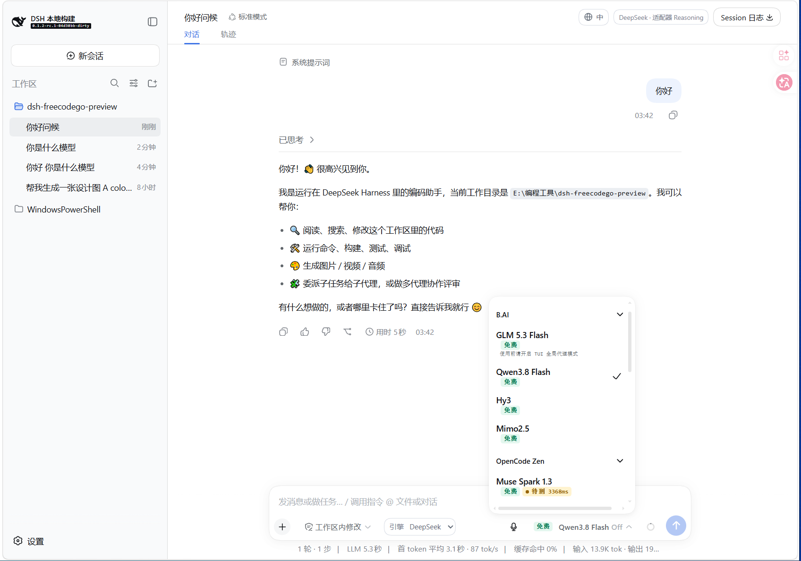
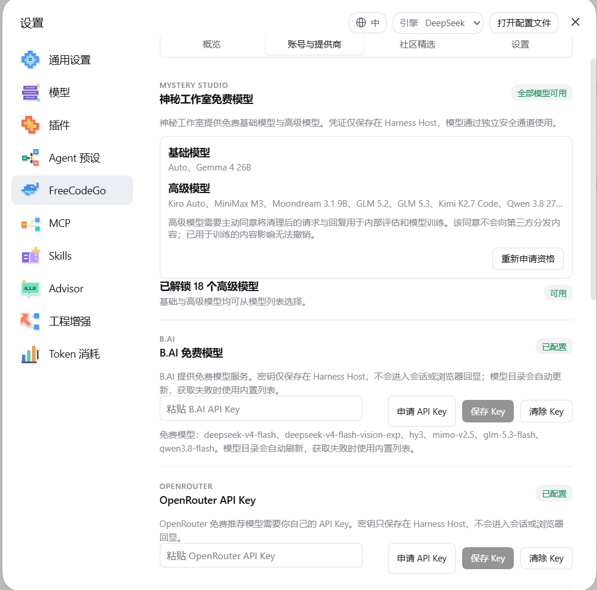
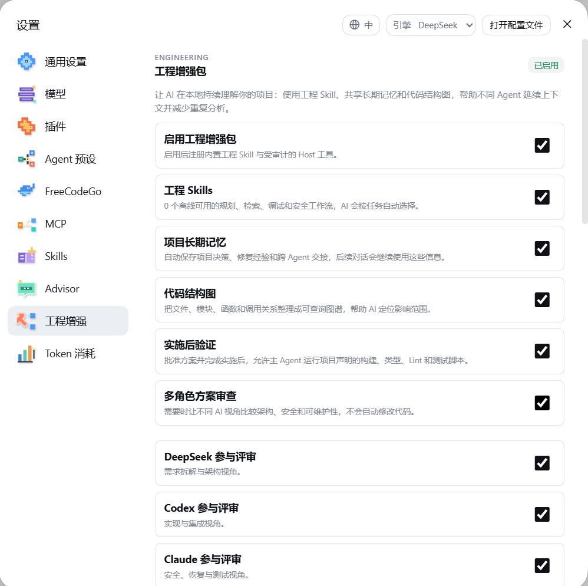
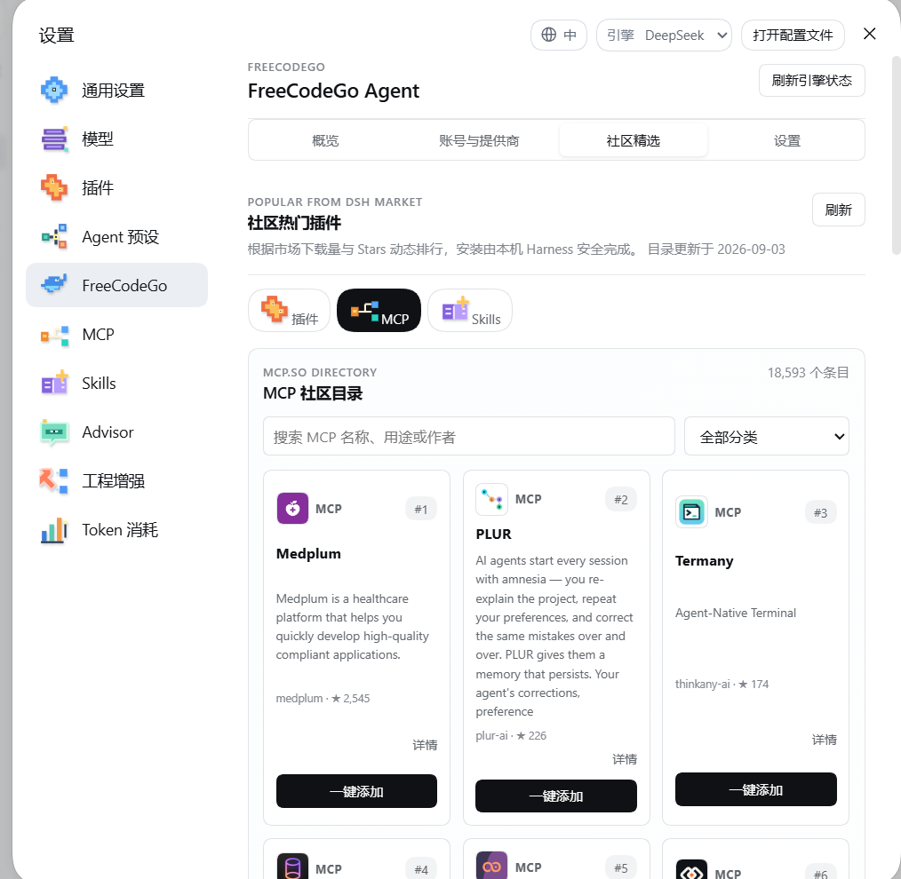

# dsh-plugin-freecodego

**面向 DeepSeek Harness 的 FreeCodeGo** —— 一个 Cordis 插件包，把 FreeCodeGo 的引擎清单、可托管的免费模型网关、按供应商的账号管理、媒体生成，以及工程能力（代码图谱 + 记忆）工具链安装进 [DeepSeek Harness](https://github.com/deepseek-ai/deepseek-harness)（`dsh`）。

[English](README.md) | 中文

FreeCodeGo **不是** DeepSeek 的产品，本仓库也不是 DeepSeek 的官方发行：它是一个插件，挂载到你自己安装的 Harness 上。对本仓库做 fork 时适用的命名规则见 [TRADEMARK.md](plugin/TRADEMARK.md)。

## 界面截图

下面五张是插件挂载后的实际界面：插件市场卡片用的是同一组图片，第一张就是卡片的预览图。

**模型选择器** —— 可托管的模型目录与它读取的免费供应商，按供应商分组，每行带自己的免费与延迟标记；输入区旁边是引擎切换。



**账号与提供商** —— 设置 → FreeCodeGo → 账号与提供商：每个供应商的密钥只保留在 Harness Host，下方列出它当前的免费模型。



**工程增强** —— 总开关与它背后的能力：工程 Skills、项目长期记忆、代码结构图、实施后验证，以及多角色方案审查。



**插件安全与更新** —— 加载时的冲突防护、发行更新检查，以及统一的 MCP / Skill 能力层。


**社区精选** —— DSH 市场的热门排行与 MCP.SO 目录，一键装入本机 Harness。



## 它加了什么

- **可托管的模型目录** —— 一个选择器同时列出 FreeCodeGo 网关，以及它管理的免费供应商（OpenCode、Logfare、SenseNova、NVIDIA、VyceAI、Kilo、Agnes、Cline、WorkBuddy 国际版、Qoder、TRAE、Groq Whisper），每一行都带自己的健康、倍率与训练数据标记。
- **原生引擎** —— 一个会话可跑在 DeepSeek、Codex 或 Claude 上，各自位于已验证的运行时之后；本插件的 router 是 Harness 里唯一的 `AgentFactory`。
- **Advisor 评审回路** —— 一个独立的只读评审者，用有界的发现结论去引导当前 Agent。
- **代码审查** —— 一套 OCR 风格、针对改动本身的审查（工作区、从 merge base 起算的引用范围、或单个提交），带四层规则解析、逐文件覆盖面核算、三种报告格式、高危结论的对抗性复核，以及可选的收尾门禁。
- **工程增强**（由一个总开关控制）—— 多引擎工程评审、多成员团队、CodeGraph / Graphify 代码图谱、按项目持久化的工程记忆、检查点与块级日志、仓库结构图，以及确定性的扫描检查。
- **上下文与成本纪律** —— Headroom 输出压缩（含代码骨架化）、按需取用的工具 schema（`tool_search`）、缓存冷清除与溢出回溯、模型可见的上下文预算，以及缓存未命中归因。
- **安全护栏** —— 声明式命令策略、Plan Mode、文件夹信任、同样覆盖原生引擎的凭据路径屏蔽，以及记忆写入时的凭据筛查。
- **能力扩展** —— MCP server、Skill 根目录（含 skills.sh 安装）、LSP 自动挂载、日历调度规则、声明式 hook 链、媒体生成与音频转写、语音输入、Agent 预设与 persona。
- **模型菜单控制** —— 聊天选择器显示哪些供应商与模型、原生菜单上的非交互价格/健康标注、跟随持久选择回显的选择器标签，以及不会清空已打开菜单的重连重试。
- **发行更新** —— 插件读取本仓库的 release，并安装为当前 Harness 构建的那个 bundle。

下面每一项都写明控制它的设置项，默认关闭的会直接标注。每项背后的取舍写在 [`plugin/packages/freecodego/harness-plugin/README.md`](plugin/packages/freecodego/harness-plugin/README.md) —— 那份顶层功能文档里。

## 免费模型

<!-- generated:free-models:begin by scripts/generate-free-model-tables.ts -->
下面每一行都来自各提供商自己的目录，在你打开选择器时读取；也就是说，这是那些目录在 2026-09-23 返回的结果（按名称排序，选择器里保持目录顺序），而选择器里的数量才是你查看时真正成立的数量。

| 提供商 | 免费模型 | 目录 |
|---|---|---|
| **OpenCode** | `big-pickle`、`deepseek-v4-flash-free`、`jev-1.13-free`、`ling-3.0-flash-fin-free`、`mimo-v2.5-free`、`mimo-v2.6-flash-free`、`muse-spark-1.2`、`muse-spark-1.2-contributor-free`、`muse-spark-1.3`、`muse-spark-1.3-contributor-free`、`nemotron-3-ultra-free`、`nemotron-3.5-lightning-free`、`space-bunny-free` | 80 行中的 13 行；公开，无需登录 |
| **Kilo** | `cohere/north-mini-code:free`、`dots-studio/dots-3-note-preview:free`、`inclusionai/ling-3.0-flash-fin:free`、`inclusionai/ling-3.0-flash-sante:free`、`inclusionai/ling-3.0-flash-vl:free`、`kilo-auto/free`、`liquid/lfm-2.5-2.6b:free`、`nex-agi/nex-n2.5-mini:free`、`nex-agi/nex-n2.5-pro:free`、`nvidia/nemotron-3-nano-omni-30b-a3b-reasoning:free`、`nvidia/nemotron-3-super-120b-a12b:free`、`nvidia/nemotron-3-ultra-550b-a55b:free`、`nvidia/nemotron-3.5-content-safety:free`、`nvidia/nemotron-3.5-lightning:free`、`openrouter/free`、`poolside/laguna-s-2.1:free`、`poolside/laguna-xs-2.1:free`、`qwen/qwen3.8-27b:free`、`stepfun/step-3.7-flash:free`、`thinkingmachines/inkling-small:free`、`z-ai/glm-5.2:free` | 394 行中的 21 行；公开，每个出口 IP 每小时 200 次 |
| **Logfare** | 对话 `claude-opus-4.6`、`deepseek-v3.2`、`deepseek-v4-pro-0813`、`gemma-4-26b`、`glm-5`、`glm-5.3`、`glm-5.3-flash`、`grok-4.6`、`kimi-k2.5`、`kimi-k2.6`、`kimi-k2.7-code`、`kimi-k3`、`logfare/auto`、`moondream3.1`、`qwen-3.8-27b`、`step-3.7-flash`；图片 `flux-1-schnell`、`flux-2-dev`、`flux-2-klein-4b`、`flux-2-klein-9b`、`sdxl-lightning`；音频 `melotts`、`whisper-large-v3-turbo`；其他路由 `aura-2-en`、`lucid-origin`、`nova-3`、`phoenix-1.0` | 27 行；20 行需要训练数据授权，其余 7 行不需要 |
| **Qoder** | `Qwen 3.8 Flash`（路由 `qmodel_38flash`） | 免费 flash 路由，另有每日签到活动 |
| **NVIDIA** | `google/gemma-4-31b-it`、`moonshotai/kimi-k3`、`z-ai/glm-5.3`、`z-ai/glm-5.3-flash` —— 名单里另有 `deepseek-ai/deepseek-v4-flash-0731` 与 `deepseek-ai/deepseek-v4-pro-0813`，这两个名字已不在 NVIDIA 实时目录（82 行）中 | 调用需要 API key；核对于 2026-09-23 |
| **SenseNova** | `deepseek-v4-flash`、`deepseek-v4-pro`、`glm-5.2`、`kimi-k3`、`sensenova-6.8-flash-lite` —— 均为 1M 上下文 / 128K 输出 | 名单随 bundle 内置；需要 API key |
| **TRAE** | 其目录列出的那些行 | 免费额度每日重置，按账号 |
| **Cline** | 目录标记 `×0 · 官方免费模型` 的那些行 | 账号池 |
| **WorkBuddy 国际版** | 积分包标记 `x0` 的那些行 | 设备登录，可放多个账号 |
| **Agnes** | 对话与图片/视频行 | 控制面账号 |
| **VyceAI** | 没有免费名单 | 每日签到额度支付其计量行 |
| **Groq** | `whisper-large-v3-turbo` | 仅转写，不是对话路由 |

这些清单跟随各自的目录：上游下架的路由会在下次读取时从表中消失 —— 这正是本表由 `scripts/generate-free-model-tables.ts` 生成、而不是凭记忆维护的原因。

TRAE、Cline、WorkBuddy 国际版、Agnes 不公布固定名单，因此它们的行在到达时计数，而不在此列名。

Logfare 有 20 行位于训练数据授权之后，选择器会标注而不是隐藏它们。

<!-- generated:free-models:end -->

## 功能详解

### 引擎与路由

- **三个引擎，一个 router。** DeepSeek 跑在官方 AgentLoop 里；Codex 与 Claude 位于受管的原生运行时之后（一个子进程宿主，加上跑在 Host 进程内的 Claude Agent SDK 运行时），并通过 Host 桥回传。router 是 Harness 里**唯一**的 `AgentFactory`，所以指名要原生引擎的会话绝不会静默回退到 DeepSeek。
- **准入靠事实，不靠假设。** 只有当已验证的 manifest、digest、协议 ABI、worker 路径与状态目录同时到达时，原生引擎才会被准入。运行时通过同一条下载路径获取：边写盘边哈希，瞬时传输失败重试一次，digest 不匹配即为终局、不再重试。
- **默认值。** `setDefaultEngine` 与 `setDefaultModel` 决定新会话从哪个引擎、哪个模型开始，并持久化在本插件自有组合条目（`freecodego-harness-plugin`）的设置文档中；已有会话保持自己那份持久计划。
- **子代理路由**（`autoSubagentModelSelection`，默认开）。每一条存活的文本模型路由都会同步进 Harness 的 `subagent-model-selection`，因此新的顶层会话会拿到 `provider` / `model` / `reasoning_effort`，以及按需查询的 `list_subagent_models` 发现工具。子代理继承父会话的执行引擎，每次委派都可覆盖具体的 LLM 路由；暂时故障的供应商会保留上一次已授权的路由。
- **原生会话里的第三方插件工具。** Codex 与 Claude 投影出与 DeepSeek 相同的、按 Agent 作用域划分的工具 schema —— 包括后续第三方插件注册的工具 —— 不做任何名字白名单；调用回到 Host ToolRuntime，因此原插件仍然掌握校验、权限、审计与取消。Codex 每次提示前刷新清单，Claude 每次查询重建进程内的 MCP server。
- **本地路由。** OpenAI 兼容与 Anthropic 兼容供应商走现有的 `dsh-llm-pi-ai` 插件与共享的 Models 设置编辑器；API key 存在 Harness 凭据服务里，永远不会到浏览器。
- **Zcode GLM-5.3 Flash 促销。** 只有当前 Z.AI 账号持有 Coding Plan 凭据时，Zcode 模型目录才会给 `glm-5.3-flash` 加标注；限免窗口（Asia/Shanghai，每月 20 日之前，23:00 至次日 09:00）由 Host 侧计算 —— 客户端时钟或任何账号声明都无法换来这份权益。

### 模型目录、供应商与账号

- **一个目录，多个上游。** 选择器同时列出 FreeCodeGo 网关与插件管理的免费供应商：OpenCode、Logfare、SenseNova、NVIDIA、VyceAI、Kilo、Agnes、Cline、WorkBuddy 国际版、Qoder、TRAE，音频转写则由 Groq Whisper 承担。每行带健康、倍率与训练数据标记，通过有界的缓存 TTL 刷新；暂时失败的供应商保留上一次已授权的路由，而不是把选择器清空。
- **供应商专用适配器 + 共享账号池。** 每个免费供应商都有自己的上游契约（不复用同一个通用 OpenAI 兼容适配器是有实测理由的），四个成池的家族 —— Cline、WorkBuddy 国际版、Qoder 与 TRAE —— 会在账号间轮换：额度按模型或按账号发放，请求按轮次换账号，401 重新鉴权失败或 402/429 额度响应会让受影响的账号先冷却，再尝试下一个。
- **登录流程。** WorkBuddy 国际版走设备授权流程（打开浏览器 URL 由用户确认，随后轮询），access/refresh token 通过 Host 凭据服务以 `WORKBUDDY_AUTH` 存储；多个账号可独立增删。Agnes 通过其控制面接口完成注册或登录，并自动创建默认 API key，以 `AGNES_AUTH` / `AGNES_API_KEY` 存储。Cline 与 Logfare 的凭据同样以凭据引用形式保存。
- **浏览器代理的 OAuth 登录。** Harness 插件既没有窗口接收浏览器 fragment，也没有 `freecodego://` 协议处理器，因此登录直接走后端自己的 `/auth/oauth/{provider}/start`，带 `redirect=/oauth/desktop?state=<ours>&plugin=1`，再轮询 `GET /auth/oauth/desktop/poll` 直到签发的凭据对到达，并把它收进 Host 凭据保险库 —— 后端把它存在收到的 state 下，并给用户一个普通确认页而不是深链。同一张卡片还能完成 MFA、绑定或创建账号、发送验证码，全部经由 Host Remotes。
- **模型选择器显示什么，由用户决定。** 聊天里的模型列表是 Harness 原生菜单，Host 会把所有可服务的适配器都注册进去，所以"把某个供应商或某个模型移出列表"只能发生在账号与供应商页面。存储是**反向**的 —— 除非明确记录为隐藏，否则可见 —— 并带两条声明的例外：按量计费供应商的有价行默认隐藏，精选供应商的未命名行默认隐藏；因此从没打开过这些开关的用户不会看到变化，而新增的**有价**模型不会自己打开。这个决定会在旁边已经打开的那份菜单上立刻生效，因为它属于供应商而不是渲染它的那个页面。
- **原生菜单只做标注，不做替换。** 官方选择器继续拥有选择、焦点、滚动与推理档位；本插件只对符合稳定 ARIA 菜单契约的行追加非交互标签（来源、价格类别、供应商健康），于是菜单本身就能说明哪些行免费、按量还是降级，而不必再维护第二个选择器。
- **被拒绝的选择不会读成已应用的选择。** 选择器上的标签与会话里那份持久选择保持同步，而被拒绝的 `selectModel` 会以 Remote 失败的形式 resolve 而不是抛异常，因此回显检查的是**结果**而不只是有没有抛 —— 否则一次拒绝会把它刚写下的原因清掉。另有一层重试吸收短暂 Host 重连（1 分钟、10 分钟、30 分钟退避）且不清空上一次目录，所以断连时已经打开的菜单会恢复，而不是变空。
- **冷启动的目录从秒级降到毫秒级。** Host 构建模型目录时会同时向每个已注册路由要模型列表并等最慢的那个；这个部署 13 个路由里有 12 个属于本插件，而它们是唯一必须读网络目录的。以重启后的 Host 实测：首次目录 5,528 ms，热态 12 ms —— 那 5.5 秒里菜单没有任何供应商分组可画，这正是"打开选择器像没打开"的来源。因此 FreeCodeGo 那一半改由这个部署已经知道的目录直接回答，而不是再跑一轮供应商读取。
- **一张失败表，三种决策。** 同一个失败从每个路由来时的形状都不一样 —— `fetch` 拒绝、自定义错误对象上的状态码、abort 引发的 DOMException、适配器自带的机器码、供应商自己的措辞 —— 而在每个调用点按消息文本分支，正是"限流被无限重试、上下文溢出被重试到额度耗尽"的来源。所有失败只分类一次，每种对应一个决策：重试、让账号冷却、或让这一回合失败。
- **脱敏是铁律。** 浏览器只会收到脱敏状态：供应商凭据、会话 token、API key 一律不发送到界面，也不会在 Harness 那套凭据协议之外再加一套。
- **网关账号、计费与套餐。** 配置 `gateway.baseUrl`（默认 `https://freecodego.com`，必须为 HTTPS）后，设置界面会显示账号、额度与用量详情，选择支付方式与套餐，打开结账链接，轮询订单，并渲染实时的模型价格表；移动端认证、bootstrap/模型状态、额度、运行时健康、价格、套餐、结账与订单轮询复用 FreeCodeGo v1 路由。支付校验/取消与收据邮件投递已接通；供应商侧支付确认、二进制收据下载、完整运行时产物覆盖、干净 profile 安装与端到端 Web 测试仍是发布门禁。
- **媒体默认值**（本条目的 `mediaDefaults`）。`freecodego_generate_image`、`freecodego_generate_video`、`freecodego_generate_audio` 与 `freecodego_transcribe_audio` 执行时读取当前默认值；面向模型的 schema 刻意不提供模型覆盖项。网关媒体请求复用 Host 保险库中的账号 token，base64 图片进入 Harness 附件存储并以图片内容块返回，生成的音频保存在工作区的 `.freecodego/generated-media` 下。
- **生图与生视频离「彻底消失」只差一个开关**（`mediaGenerationEnabled`，默认开启）。它管辖 `freecodego_generate_image`、`freecodego_generate_video`，以及旧名字 `agnes_generate_image` / `agnes_generate_video`；关掉它会把这些工具**注销**，于是它们从模型的工具表里整体消失，而不是等到调用时才报错。`freecodego_generate_audio` 与 `freecodego_transcribe_audio` 不在其中：一个往活动工作区写，一个从活动工作区读。
- **生图与生视频的路线由 provider 决定，不由模型名决定。** 生图讲 OpenAI Images 契约（`/images/generations`，带源图时走 `/images/edits`）、Seedream 的 `image: [...]` 融合体、Gemini 的 `:generateContent`、Imagen 的 `:predict`，以及 DashScope 的 `multimodal-generation`。生视频讲九条：Kling（`text2video` / `image2video` / `multi-image2video`）、Ark（`/contents/generations/tasks`）、DashScope 的异步 video-synthesis、MiniMax Hailuo、Vidu、Gemini 的 Veo `:predictLongRunning`、xAI 的 `/videos/generations`（含编辑与续写）、OpenAI 的 `/videos`，以及网关对一切未识别 provider 的通用形状。模型名单从 Harness 模型目录、托管目录、Logfare 与 Agnes 实时读取而非钉死；完整表格见包内 README。

### Advisor 评审回路

- 一个独立评审者，默认在公开的 `freecodego/hy3` 路由上启用，用**独立的**模型上下文读取持久化的回合事件，只持有有界的只读工作区工具（`read`、`glob`、`grep`）。凭据、隐藏推理与未受限的主 Agent 工具永远不会被复制进评审上下文。
- 每个 DeepSeek、Codex、Claude Agent 都会拿到 `advisor_status`、`advisor_review`、`advisor_notes`，因此当前 Agent 能查看评审者、在检查点请求第二意见、并直接消费此前的发现结论，无需额外 UI 操作。
- 具体的疑虑或阻碍会引导（steer）Agent；低严重度或处于冷却期的发现会在下一个安全步骤注入。原生 Codex 与 Claude 把引导作为后续的原生回合消费，并把注入暂存到下一次用户回合。发现结论与 token 用量追加进 Harness 会话；关闭 Agent 控制后它们只保留为 `record` 事件。
- 路由与投递设置实时生效；原生会话每回合前刷新投影出来的 Harness 工具。

### 工程增强

工程增强位于一个总开关之后（`engineeringEnabled`，默认**开启**）。它会挂载经审计的内置工程 Skills、静态资产 Doctor 检查、有界的声明式脚本验证，以及 DeepSeek、Claude、Codex 共用的 Host 侧工具。把它关掉就等于停用整套增强包。设置页只放总开关，细分控制项在动态的 Engineering 侧边栏条目里。

#### 多引擎评审与验证

- `engineering_team_start` 让当前根 Agent 保持在自己选定的引擎上，同时启动隔离的 DeepSeek、Codex、Claude 子 Agent，对一个目标与草稿计划做有界只读评审，可选一轮交叉质询。子 Agent 不能编辑文件、执行 shell、创建另一个团队或更改权限。参与者可独立开关，设置面板会在允许启用某个参与者之前报告其 Codex/Claude 运行时是否已安装。
- 只有当配置的最少参与者数量完成时才算达到法定人数；缺失的运行时与失败的参与者会被分别报告。团队可前台运行，也可返回 `council_*` id 用 `engineering_team_status` 轮询；`engineering_team_cancel` 会取消所有子 Agent；父会话恢复后仍可通过 `engineering_team_report` 取回完成报告。`engineeringCouncilAutoRun`（默认关）可在计划获批后自动跑一轮评审，因此默认把控制权留给用户。
- 任务暴露明确的生命周期（`queued`、`running`、`awaiting_approval`、`implementing`、`verifying` 与终止态），以会话事件持久化，所以被中断的活跃任务会恢复为 `stale`，而不是静默消失。审批记录带计划摘要、工作区指纹、策略摘要与有效期；其中任何一项变化都会 fail closed，要求重新评审。
- **完成的报告是证据，不是改代码的许可。** 必须由用户明确批准或拒绝后才能实施；只有获批的报告才能跑验证，且主 Agent 必须先调用 `engineering_team_mark_implemented` 提交有界摘要，`engineering_team_verify` 才会被接受。
- **验证是算出来的，不是推断的。** 每个阶段结果都带它执行的命令与退出状态；没能跑的阶段报告 `skipped`、`unavailable` 或 `refused`，绝不算通过。只有每个声明阶段都以记录在案的证据通过，**且**至少一个对抗性探针运行并守住了预期，结论才是 `verified`。探针在运行**之前**声明，带明确预期（对应当拒绝新输入的守卫则是 `fail`）与说明它会捕获哪种破坏的理由 —— 因此一个不再触发的守卫会把这次运行变红，而不是静默通过。
- **探针由模型撰写，因此控制项 fail closed。** 空探针、格式错误的探针、理由为空的探针，以及触网、发布或删除的探针，都会被记为 `refused`，从而把运行强制为 `failed`。命令不经 shell 派生，网络抓取被禁用，每个探针与阶段共享五分钟超时，且每个探针前后都对工作区取指纹，所以一个改动了工作区的检查不能同时充当"工作区没问题"的证据。
- **按比例验证。** 档位（`light` / `standard` / `thorough`）由改动本身推导，安全相关片段、架构片段（manifest、lockfile、CI、迁移）与改动面广度都会强制 `thorough`。任何档位下都有两条不变式：档位可以减少**跑哪些**阶段，绝不改变**什么算证据**；且档位必须连同它省略了什么一起报告。
- **验证在"被问到的那一刻"重新读取，而不只在运行时读一次。** 运行自身的证据回答的是探针是否有归属；而这份结论的**覆盖范围**是另一个问题，且它在运行结束后还会变 —— 工作区可能又被改了，一条写下时为真的记录会变成对从未见过的那份改动的绿灯。因此这项审计会按当下这棵树重新核对结论，这也正是一条通过的验证不再被引用于它从未覆盖的改动的原因。
- 获批的报告还可以写进工作区，成为 `spec` / `plan` / `tasks` 三件套，把一次完成的评审变成项目自己拥有的、可 diff 的产物，而不是别人读不到的对话。

#### 代码审查

这套审查机制是一条 OCR 风格（open-code-review）的流水线，重建为 Host 自有的机件：一个引擎上的四个工具，一个不花模型调用的确定性预览，以及可选的收尾门禁。

- **四个入口，一个引擎。** `engineering_code_review` 审查一次改动（`mode: workspace | range | commit`，配 `from` / `to` / `commit`，输出格式 `text | json | sarif`）；`engineering_review_rules` 回答"会审查什么、按哪条规则"，既是检验 exclude 模式是否生效的廉价手段，也是调用方自己去做审查时需要的那个不含模型调用的一半；`engineering_review_status` 说明现在在跑什么；`engineering_review_report` 把上一次结果按另一种读者（人、Agent、扫描集成）重新渲染。
- **审查什么是决定，不是 `git diff | head`。** 工作区审查指已暂存**加**未暂存**加**未跟踪，因为未跟踪那一半是朴素 diff 永远看不到、而新文件最严重的缺陷正好住在里面的部分；范围审查从 **merge base** 开始 diff，否则基线分支上的每个提交都会变成这次审查的问题；提交审查对比它自己的第一父提交。跳过是一个封闭的原因集合 —— 二进制内容、过大的文件、项目自己的排除模式 —— 每一条都被记录，因为一个没有原因就消失的文件，与一次被审查遗忘的文件无法区分。
- **覆盖面要交代清楚，包括没读的文件。** 只要还有文件停在 `pending`，这次运行就不能结束：检查会点名缺失的文件，而不是让分母悄悄缩小。一份组装好的报告按三种格式渲染，所以同一次运行不会在文本里说出 SARIF 里没有的结论，也不会两种格式给出不同的覆盖率；被事实核查否掉或被裁定驳回的结论留在 `json` 里并带上被丢掉的原因，而 `text` 会**声明它扣下了多少条** —— 因为一份静默省略结论的报告，会教会读者把那个数字当成全部真相。
- **规则分层解析：`custom` → `project` → `global` → `system`。** 命中的第一层胜出，而不是跨层命中第一个模式，这正是项目覆盖能成为覆盖而不是合并的原因。项目的标准放在 `.opencodereview/rule.json`、`.dsh/review.json` 或 `.freecodego/review.json` —— 存在的第一个就是**那个**项目层，因为把两份合并起来会让生效标准变成一份没人写过、也没人能预测的文档 —— 而用户级 `~/.opencodereview/rule.json` 是仓库无法自己撰写的那一层。格式错误的规则文件会被报告，绝不会被忽略：一个以为自己的标准正在生效、而文件里多了一个尾逗号的项目，比从没写过规则文件的项目处境更差。条目上的 `mergeSystemRule` 可以同时纳入随插件发布的那份基线，所以新增一条检查不会静默丢掉所有默认项。
- **高危结论会被对抗性复核**（`reviewEscalation`，默认关）。产出一个 `critical` 的那个审查者，是判断它是否真实的最差人选，所以会请一个独立裁定者去**反驳**而不是去同意 —— 这是一个不对称的问题，因为"确认"是偷懒答案的默认。驳回需要拿出针对该结论的 diff 证据且确认票未达法定数；它是唯一会移除结论的路径，并且与事实核查不同，这一级是**朝保留的方向失败**。
- **深度审查**（`reviewDeep`，默认关）会用每个改动文件各自的只读子 Agent 去读它，可以搜索调用方、打开某个测试覆盖的实现，而不是只凭 diff 判断。默认关，因为它对每个文件开一个子 Agent —— 这是一个有代价的决定，而不是更好的默认值。
- **收尾门禁是可选的。** `reviewMode` 取 `off`、`record`（跑那一遍，结论成为持久会话事件）或 `gate`（同一遍在冷却已过时，还会把达到 `reviewThreshold` 的结论注入回会话；注入的消息会继续这一回合，所以 Agent 必须回应这个结论才能结束）。它刻意是**一遍**审查配两个投递通道：逐回合审查与收尾门禁会读两次同一份 diff，并可能对同一棵工作树给出互相矛盾的结论。三条规则约束成本，每条都有测试：没有任何改动的回合绝不审查；同一个改动集按指纹**与**工作区修订各审一次（已被修改的文件再改一次不改变路径列表，只看路径会把两个不同状态当成同一个）；一次运行只限于这一回合碰过的东西，而不是所有已经是脏的文件。
- **面板与工具共用一条路由。** 审查使用本插件的第二模型路由（`advisorProvider` / `advisorModel`，默认 OpenCode 的虚拟 `auto`），而不是新增一对设置，因此全新安装开箱就能审查，改设置无需重启即可生效。设置页显示模式、阈值、冷却、深度审查与对抗复核，可发起一次运行（发起即返回，再轮询同一个 Remote），并连同覆盖面算术一起渲染报告。

#### 多成员团队

- **任务板是骨架。** 任务按 id 顺序发放；依赖未完成的任务永远不会被提供；认领不可被抢 —— 拒绝会说明是谁持有该任务或它在等什么。只有当前持有者能完成或判定失败，这才让任务板成为"谁做了什么"的审计。每次变更都会推进版本号并追加到按任务分账的 ledger；严格入口要求出示认领 token，因此重启后仍在的负责人名字不会被误认为同一个成员；`rerun` 会用同一个 id 重开失败或取消的任务，而不是丢掉尝试次数。
- **"等人回复"是一种状态，不是一种判决。** `needs-review` 记录在等谁、从何时起、属于哪次认领；任务板把它单列一桶并点名被停放的任务。因依赖失败而受阻的任务是**推导**出来的而非存储的，所以重试依赖即可解除，不需要状态迁移。
- **成员。** 成员是真实的子 Agent，带按角色限定的工具允许列表；`engineering_team_member_start` / `_stop` 与 `engineering_team_recover` 负责管理。成员身份持久化在磁盘上；存活状态从活着的子进程读取，从不镜像到文件。
- **每个写入者都有自己的 git worktree**，位于 `.freecodego/worktrees/<member>` 的自有分支上（登记进 `.git/info/exclude`，避免隔离本身变成未跟踪噪音）。共享工作树只在 `engineering_team_merge` 时改变，且冲突的合并会在**报告之前**被中止，并点名冲突路径。仍带未提交改动的 worktree 会被保留，除非调用方明确确认愿意丢弃；删除失败的登记会保持 `active` 可见。worktree 生命周期也直接暴露为 `engineering_worktree_status`、`_list`、`_enter`、`_exit`。
- **角色是数据**（`team/roles.ts`，可按项目用 `.freecodego/team-roles.json` 覆盖）。一个角色带目的、能力集、工具允许/拒绝列表、模型、回合上限、沙箱模式、汇报契约，以及明确的*不负责什么*。允许列表会与能力集求交，所以不能写的角色无法靠点名拿到写入工具，`explorer` 与 `verifier` 天然只读。目前内置五个角色；增加一个角色就是增加一条记录。
- **隔离报告的是"实际生效了什么"**，而不是"请求了什么"：`enforcedBy`（`tool-scope`、`harness-policy`、`both` 或 `none`）由**解析后的工具集**与沙箱模式回读算出；只读请求出现 `enforcedBy: none` 时绝不静默。
- **手动上下文控制。** `engineering_context_compact`、`engineering_context_snip`、`engineering_context_budget` 让模型对自己最先注意到的那件事（某段内容已经用完）立刻动手，而不是等压力到来；snipping 会校验工具调用配对，边界不平衡会被拒绝，而不是被悄悄放宽。

#### 代码图谱

- **两个可互换引擎，只挂载其中一个工具族**，由 `engineeringGraphEngine` 选择（`auto` 优先无 Python 的那个；`graphify` / `codegraph` 表示"就是它，否则什么都不要"）。
- **Graphify** 在 SHA-256 校验后下载官方 `graphifyy==0.9.52` Wheel，并在 `DSH_HOME/freecodego/engineering/graphify` 下引导一份 SHA-256 钉住的官方 `uv` 与私有 Python 3.12。它的构建只把图谱、缓存与报告写进插件自有的项目目录：不产生工作区 `graphify-out`，不装 hook，不改 `PATH`，也不用 Lite Graph。工具：`engineering_graph_status`、`_search`、`_explain`、`_path`、`_affected`、`_overview`、`_canvas`、`_mcp`。
- **CodeGraph** 在 SHA-256 校验后下载针对当前 OS/CPU 的官方自包含平台包（48–62 MB），解包到 `DSH_HOME/freecodego/engineering/codegraph`。该包自带 Node 运行时，因此不需要 Python、`uv` 或 Wheel；musl Linux 会被明确拒绝而不是近似支持。它的索引位于工作区的 `.codegraph-freecodego`（带自忽略的 `.gitignore`），且只在用户明确操作时删除。工具：`engineering_codegraph_status`、`_explore`、`_search`、`_explain`、`_path`、`_affected`。
- 两个引擎都以关闭匿名遥测、后台守护进程与 CLI 自带下载回退的方式运行，且插件从不执行 `codegraph install`（那会改写用户其它 agent 的配置）。新鲜度来自回合结束后的自动更新钩子（`engineeringCodeGraphAutoUpdate`）与用户的明确操作，而不是后台 watcher。
- `engineering_repo_map` 是"永远可用"的那一半：零依赖的标识符引用图，用 PageRank 排序，并在 token 预算内渲染，所以会话启动时的结构图从不依赖某个运行时是否装好。

#### 工程记忆

- 项目记忆是 `DSH_HOME/freecodego/engineering/memory` 下的本地 SQLite 状态。Agent 可以存草稿，而召回只走"已评审"的 `Search → Timeline → Get` 流程；草稿永不进入自动召回。
- 只有面向用户的 Remote 才能批准、拒绝、导出、清理或删除记录，且记忆操作用一个打开的工作区会话界定作用域。记忆还可以沉淀为 `.freecodego/skill-drafts/` 下的 Skill 草稿。
- 召回有围栏与预算（`engineeringMemoryContextTokenBudget`，默认 1,200 token），注入块被围栏包裹且标签被中和，因此仓库文本无法冒充记忆。
- **写入路径上的凭据筛查。** 带标签或带厂商前缀的凭据会直接拒绝该条目；只匹配形状的（JWT、裸 `sk-`、PEM 块）会被就地脱敏并保留条目。发现结论永远不返回密钥本身 —— 只有四字符前缀与长度。
- **整合是分阶段放量，因为它会写入。** 一次整合先取一把带租约的锁（带过期时间的锁文件，所以崩掉的整合可以恢复；而**活着的**租约会被报成 `lease-held` 而不是被重试），读取开始时已存在的那份冻结快照，跑一次不带工具调用的模型调用，然后原子地写入主题文件。因此 `memoryRollout` 是四个阶段而不是一个开关：`off`、`record_only`、`shadow` —— 完整跑完包括模型调用但什么都不提交，操作者可以先读到模型**本来会**写什么 —— 以及 `active`。
- **`MEMORY.md` 是一份有界的绝对路径索引。** 路径必须是绝对的，因为相对指针要针对某个作用域根解析，而解析错的模型会报告"什么都没找到"而不是"路径坏了"；溢出时整行丢弃并说明丢了多少，因为被截断的描述会让索引声称在描述一条它已经不再描述的记录。
- **遗忘要凭证据，绝不凭模式。** "忘掉你知道的关于 X 的一切"是这个子系统唯一不能靠把 X 变成一组文件来回答的请求：那是一次相关性判断，判宽了就会以没有撤销的方式删掉记录，而这个存储的全部价值就在于它记得。调用方要把打算删除的字节连同哈希一起交出来，而目录、通配符、哈希不匹配以及另外四种形状都是拒绝而不是警告。
- **记忆有管理面，遥测是 schema。** 设置面板可以按需整合、重建索引、导出已审核记忆、创建备份、清理过期内容，全部限定在当前打开的工作区会话内。每个遥测事件都由同一个构造器**构造**，它拒绝未知字段、也拒绝自由文本值，因为记忆流水线看得到用户陈述、主题名、关键词与路径，而一个看似无害的 `{ topic }` 字段会把私人笔记的精炼版本永久送进任何收集指标的容器。这种拒绝是抛错而不是丢弃，所以"以为正在收集某指标"会在测试里失败，而不是静悄悄地失败。

#### 检查点与块级追踪

- 检查点（`engineering_checkpoint_capture`、`_diff`、`_pin`、`_list`、`_restore`）以文件粒度回答"那次调用之前工作区长什么样"；`_restore` 是写入者，在 Plan Mode 下会被拒绝。
- **块级追踪**会为每一次变更型工具调用记录它改动过的连续行区间，归属到 harness 自己的 `callId`，并针对文件当前文本回退其中一块（`engineering_hunks`、`engineering_hunk_revert`）。**失败**的调用也会记录，因为"写了东西然后报错"的改动是读对话记录永远找不到的那种。后续编辑会取代它替换掉的那几行，被覆盖的块会拒绝单独回退并点名覆盖它的那块。回退会先校验记录的后像仍在原位或唯一地出现在别处，否则报告 `drifted` 而不是猜测；文件行尾保持原样，解析到工作区之外的路径会被拒绝。

#### 检查与确定性扫描选择

- `engineering_inspect` 报告一次运行会读什么，包括选择清单：覆盖分母、每一条排除及其理由、字节与 token 合计，以及大小无法判定的文件名。各道闸门按明确顺序执行 —— 删除先从分母里离开；凭据路径在任何模式规则之前被拒绝（所以 vendored 源码里的凭据文件报告的是 `credential`）；模式随后点名"发现了也无法处理"的路径：依赖目录、vendored 源码、构建产物、生成的元数据、lockfile。测试文件被刻意**不**排除，因为本插件最紧盯的缺陷类型正是"什么都没断言却在报绿"的测试。
- 该段落刻意**不**受文件夹信任门禁管辖，差别在于它读什么 —— 只有大小和路径名，从不读内容。
- 同区还有：`engineering_doctor`（静态资产检查）、`engineering_status`、`engineering_surface_report`（注入面锁定）、`engineering_persona_list` 与 `engineering_handoff_create`。

#### 评测与持久任务

- `engineering-eval` 是对插件自身工程机制的确定性、可重跑能力评测 —— 因为"已经追平上游"这种说法若不能重跑，就不是证据。
- 工程任务是持久的、可本地取消的：Harness 的任务注册表掌管存活运行（稳定 id、`job_output` / `job_list` / `job_kill`、完成通知投递进会话），私有 SQLite 存储掌管审计轨迹并跨进程存活。Host 重启后命令绝不续跑 —— 当时活着的任务会以 `interrupted` 重开。

### 上下文与成本纪律

这些机制共享一个想法：只写成散文的规则既无法被强制、也无法被评审；而模型看不见的成本，是它无法避免的成本。

- **Headroom 输出压缩。** 过大的工具输出按**形状**（日志、JSON、diff、搜索、表格、配置、散文、HTML）压缩，每个策略只在自己确实能缩小输入时才运行。持久会话日志保留完整原文，压缩文本带 `hash=<24 hex>` 标记，模型可用 `headroom_retrieve` 取回任何被省略的文本：线路上有损，端到端无损。
- **代码骨架化**（`headroomCodeSkeletonEnabled`，默认开）。`read`、`read_file`、`view` 的结果被归约为 import、声明、类型成员、签名、装饰器与文档注释。契约是"子序列"：**保留的每一行都是逐字节原文，包括它的 `N: ` 前缀**，只有整段连续的正文行会被替换，且每段由一条点名其覆盖行范围的标记替代 —— 因此锚定在保留行上的 Edit 依然匹配。太小、已被其它压缩器接管、属于散文、是错误结果或缩减不足 25% 的读取会被拒绝处理而不是猜测。在 1,983 个真实仓库源码上实测，骨架平均去掉约 61.5% 的文件字节（中位 58.3%）；重放抽样会话后，重复传输的 token 下降 16.6%。关掉该开关即恢复逐字节读取。
- **按需取用的工具 schema**（`deferredToolSchemasEnabled`，默认开）。被延迟的工具仍然注册，但暂不提供 schema，因此一次用不到的回合不会为它们付出定义成本。`tool_search` 按需返回定义，并只为自己返回过的工具解除调用限制，所以一个延迟工具在一次发现调用之后与即时工具一样可用。查询形式：`select:A,B` 精确点名，`+term rest` 要求名字里出现该词，裸关键词用于排序，`list:<prefix>`（或 `list:all`）返回不带 schema 的名字。排序用名字与描述上的 BM25F（稀有度相对延迟目录计算、词频饱和、按描述长度归一），而不是子串计数。工具自身的描述刻意保持静态：那里放动态索引会让每次设置变更都作废提示缓存。索引和自己别的输出一样计价，并会说明它丢掉了什么。
- **缓存冷清除**（`cacheColdClearEnabled`，默认开）。当距上一条主循环 assistant 消息已超过一小时，供应商的提示缓存必然已过期、整段前缀反正会被重写，因此在下一个请求**之前**清除较旧的工具结果。阈值高于所有已公布的 TTL，所以该机制无法制造一次本来不会发生的未命中；按会话标记让清除天然幂等。
- **溢出与回溯**（`spillRecallEnabled`，默认开）。被清除的结果通过 Harness 的 spill 能力寄放，标记里带定位符而不是死胡同，所以重读内容不再需要重跑工具。`spill_recall` 逐字节分页取回寄放的产物，并返回下一次该请求的偏移量，因此翻阅它不会在文件开头处静默停止。
- **模型可见的上下文预算**（`contextBudgetEnabled`，默认开）。模型会被告知窗口有多满，量化成五档以免每回合重写缓存前缀，并且**追加**在末尾，所以最后一个缓存断点之前的一切仍是命中。估算值会标注为估算；未知窗口如实说明未知；不规定任何阈值，只给条件与对应的补救办法。精确数字由 `engineering_context_budget` 提供，且它是延迟工具，所以这份精度在没人问之前不花钱。
- **缓存未命中归因与请求形状指纹**（`cacheBreakAttributionEnabled`，默认开）。本地账本记录每回合花了多少，也记录**浪费**了多少：上一轮未被缓存读取的提示字节，按付费价减缓存读取价计价，并标注原因（模型换了、供应商 TTL 过期、前缀本身移动了）。1024 token 及以下的移动视为断点粒度而忽略；从不报告缓存的供应商记为"无法归因"，而不是每回合 100% 未命中。另有一路把每次请求的线上形状哈希下来 —— 系统文本、工具集、**每个工具各自的 schema**、模型、betas、预算档 —— 让下一次缓存读取下降能归因到一个具名变化；曾经移动过前缀的开关会保持"粘住开启"，而不是允许再次翻转。
- **差分上下文注入。** 注入的常驻上下文被拆成带快照的具名小节：未变的小节**什么都不发**，变了的小节先发替换通知，消失的小节发明确的移除通知（模型只是"看不见了"的指令会被继续遵守），而恢复、压缩或重启之后的 `unknown` 按"仍可能持有"处理并重发通知。因预算被截短的小节报告 `incomplete`，于是"我们看过、确实没有"与"我们不再看了"始终可区分。
- **压缩经济学与保真度。** 压缩是否划算（它会重写可复用前缀、按缓存**写入**计费）是算出来的而不是假设的；压缩摘要会与它替换掉的历史做核对，因为那是唯一一个"源在同一提交里被删除"的产物。
- **失控循环守卫。** `assistantLoopGuardEnabled` 在回答还在写的过程中读取 assistant 流并终止自我重复；`doomLoopGuardEnabled` 与重复工具调用守卫覆盖另一种失效模式；`abort-drain.ts` 在回合被取消时把**已经算出来**的工作做完，而不是丢弃用户已付过 token 的结果。
- **侧信道预算。** Advisor 与每个 council 视角都是侧信道，因此每次调用都在发送前对照 Harness 的压缩阈值测量，并记录每个信道最差（而非最近）的占用。这只报告，从不强制。
- **提示词到底由什么组成**（`engineering_context_prompt`）。`context-budget.ts` 说窗口有多**满**，缓存归因说一次未命中**花了多少**；两者都不说这些 token **由什么构成** —— 而这正是平台自己那些决策背后的疑问：延迟 schema 这项工作之所以存在，是因为工具定义占了 13,454 token 固定块中的 45.7–47.4 KB，而那个数字来自一次离线测量，而不是运行时可问的任何东西。这个工具逐节点返回整棵树（系统文本、工具块、常驻指引、Skills、注入片段、对话），每个节点带自己的体积，于是"提示词很大"有了下一步。
- **压缩后补灌**（`rehydrationEnabled`，默认开）。只有摘要会丢掉那些从来不属于对话语义内容的常驻上下文，所以当压缩器遮蔽一段范围后，插件会把它原本承载的东西重新注入：持久项目记忆、最新待办列表、最新工程检查点。一切都从会话已经记录的数据回放，因此回放不可能与它恢复的历史互相矛盾。可选的对话弧变体（`rehydrationArcEnabled`，默认关）以同样方式折叠目标与决策。

### 安全护栏

- **文件夹信任**（`folderTrustEnabled`，默认开）是所有由仓库内容驱动的项目级界面的统一闸门 —— 项目 MCP server、项目 Skill 根、项目 persona、项目团队角色 —— 因此打开一个不受信任的检出无法让宿主代为执行或读取任何东西，而用户有一个动作明确表达"我信任这个仓库"。基于 PATH 探测的 LSP 挂载刻意**不**受此门禁：它不读取仓库提供的任何东西。
- **声明式命令策略**（`commandPolicyEnabled`，默认开）。规则即数据：有序 token 模式（允许备选）、`allow` / `prompt` / `forbidden` 决策、理由，以及 `match` / `notMatch` 示例 —— 自身示例不成立的规则会在加载时被拒绝并给出诊断，因此规则集在它被写下的地方就自测。最长模式胜出、同长取更早的规则，这正是把窄的 `forbidden` 放在宽的 `prompt` 前面的方法。`hostExecutable(name, paths)` 钉住哪些绝对路径可以通过 basename 规则解析，所以一个被放入的 `./git` 无法满足为 `/usr/bin/git` 写的规则。只有 `forbidden` 会变成拒绝：单调守卫无法把拒绝反转成审批请求，因此 `prompt` 交给真正能发问的审批层。
- **Plan Mode**（`planModeEnabled`，默认开）是按会话持久化的模式，从结构上拒绝改动工作区：改文件的工具被拒，shell 命令由同一套命令策略判定，读取、搜索与跑检查仍然可用。它不会因为一句话要求执行而结束 —— 只有 `engineering_plan_mode` 且 `action: "exit"` 才能离开；模式规则通过片段日志注入，所以离开时发的是移除通知，而不是留下悬空的旧限制。
- **凭据路径屏蔽与命令策略覆盖原生引擎。** 原生引擎自带文件与 shell 工具，它们从不经过 Harness 工具注册表；因此插件在原生权限接缝处同样执行自己的守卫，Codex 与 Claude 无法静默跳过 Host 本会拒绝的动作。
- **动作评审策略**（`engineeringActionReviewEnabled`，默认关，且刻意不挂在逐工具热路径上）。策略那一半是完整的：按历史世代（压缩或回滚后强制全量重读）的增量对话游标、把截断标记本身计入预算的分节 token 上限、按会话的评审预算，以及从会话而非动作派生的稳定缓存键。"缺席"从不是允许 —— 未配置评审者、预算耗尽、评审者抛错，一律返回 `ask-user`。
- **注入面锁定。** `engineering_surface_report` 测量本插件注入了多少字节的工具 schema 与指引，并与一份已评审的锁定值做 diff，于是"改提示词"变成可见的 diff，而不是不可见的。

### 模型循环之外的能力

- **MCP server**（`mcpEnabled`，默认关）。启用的 server 由 Host 连接一次并注册为 DeepSeek 的 Harness 工具；Claude 通过进程内的 `freecodego-host` MCP server 收到发现的 schema 并调用 Host 桥；Codex 在自己的 app-server 配置里收到启用的 server 定义。社区页通过 Host Remote 读取有界分页的 MCP.so 元数据，只有当发布详情能被共享注册表表达、且没有未解析的环境变量或 header 值时，才提供一键安装；任何需要凭据的条目都留在手动配置里，而不是报一个装不上的"成功"。
- **Skills**（`skillEnabled`，默认关；starter 根默认开）。启用的根由 Harness 文件系统 Skill provider 发现；skills.sh 安装会原子地把 Host 自有的社区目录注册为启用的自定义根，因此导入进来的单层 `SKILL.md` 包对 DeepSeek 与下一个原生会话立即可见。Claude 通过 Host 桥加载启用的 Skill，Codex 通过 `skills/extraRoots/set` 收到；禁用某项能力会卸载其 provider，从后续的原生会话中移除它。内置库整体经过审计并按根划分：starter 根含十个 Skill、默认开启（四个由模型自行施加的纪律，外加若干条只有被调用时才产生成本的 `/name` 条目），另外 23 个经审计的 Skill —— 含 vendored 的 `mattpocock/skills` 条目 —— 在打开对应开关前保持未挂载。旁边还有 Skill 地图、由已评审记忆生成草稿、冲突检查与 lockfile。
- **LSP 自动挂载**（`lspEnabled`，默认开）。只有当候选语言服务器可执行文件确实能在 PATH 上解析时，才会挂载核心 LSP 栈；因此没有语言服务器的机器照常启动，而不是在加载阶段报错。
- **调度与 hook 链。** 调度归 Harness 所有，本插件不另建第二套调度器；它补上的是 Harness 规则集无法表达的日历算术（"每个工作日 09:00"、"每月一号"），通过 `freecodego_schedule_plan` 回答。`hookChainsEnabled`（默认开）加的是基于小事件词汇表的声明式失败恢复规则，带深度守卫与冷却，因为一个会"风暴"的恢复层比没有更糟。
- **媒体、转写与语音。** 如上所述的图片、视频、音频生成与 Whisper 转写，以及输入框里的语音输入控件（`voiceInputEnabled`），经 Groq Whisper 路由转写。
- **网页搜索提供方。** 原生的网页搜索页只能配置接口地址、密钥与单次搜索次数，模型停在 DeepSeek 自己的默认值上 —— 而这正是 FreeCodeGo 安装唯一想改的一项。本插件在该页自身配置的下方加了一份模型列表，取自本插件能路由的目录；选中一行会把该模型的 Anthropic 兼容接口、线上模型 id，以及一把它自己的密钥（`FREECODEGO_WEB_SEARCH_API_KEY`，从不占用提供方自己的引用，因此用户已有的 DeepSeek 密钥保持不动）写入 `web-search-deepseek`。接口地址会按提供方的拼接规则归一化。经本地桥接转发的提供方在重启后会被**自动重建** —— 它的路由 id 与密钥是按进程生成的，所以 Host 会在启动时、第一次搜索发生之前，按记住的 provider 与模型重新解析一次；Host 做不到时（没有挂载密钥或设置服务）页面会在加载时补做。只有本插件没记下 provider/模型的那类绑定，以及重建失败的那次，才会请用户重新选择。
- **Agent 预设与 persona。** 内置 Agent 预设会安装进 `<DSH_HOME>/.agent-presets/` 并保持同步 —— 不存在时写入，识别到插件自己的版本标记时覆盖，用户手改过则保持不动 —— 于是预设无需改动 Harness 源码、无需重启就出现在模式选择器里。Persona 是 TOML 文件，优先级明确（内联设置 → 项目 `.freecodego/personas/` → `$DSH_HOME/freecodego/personas/` → 内置），带声明式输入/输出契约：必需**输入**缺失会拒绝派生（必需**输出**缺失只告警），并有 `default_isolation` 解析进 worktree 机制。项目层受信任门禁管辖，所以不受信任的检出里的 persona 文件根本不会被打开。
- **日常维护。** 会话删除（`sessionDeleteEnabled`）有两个入口，共用同一道开关与同一处失败提示：悬停在会话行末尾出现的垃圾桶控件，以及该会话“…”菜单里位于*归档会话*下方的具名*删除会话*行 —— 后者是触摸用户与键盘用户抵达同一动作的唯一路径，从菜单删除会先关闭菜单，失败也走悬停控件用的同一个提示。日志已消失时会幂等地清掉侧边栏里的陈旧行，而活跃会话必须先关闭；伴侣（companion）以角色形象展示所选会话的活动，共用两个座位 —— 侧栏标记与输入框上方的条带 —— 每种状态都有带标签的姿态，而不是要靠猜的形状。

### 设置界面

`FreeCodeGo` 设置区就是 Host 配置面：引擎世代与持久化的默认引擎状态、后端可用性、供应商路由、媒体默认值、WorkBuddy 设备登录卡片、Agnes AI 卡片、工程总开关，以及多引擎团队面板（法定人数、失败、共识、分歧，以及明确的*批准实施* / *拒绝计划*动作）。每项能力开关会注册自己的侧边栏条目，因此未启用的能力不会留下空导航：

| 条目 | 配置什么 |
|---|---|
| `FreeCodeGo` | 账号、额度与用量、套餐与结账、设备会话、媒体默认值、团队面板，以及代码审查面板（模式、阈值、冷却、深度审查、对抗复核，与一次按需运行连同它的报告） |
| `MCP` / `Skills` | MCP 连接、发现的工具与快捷模板；已配置的 Skill 根与发现到的目录 |
| `Advisor` | Advisor 路由、投递、笔记与记忆草稿 |
| `Engineering` | 总开关与细分工程控制项 |
| `Token usage` | 本地账本与脱敏用量面板 |
| 设置对话框控件 | 回复语言与默认引擎，也可从会话头部、输入框与 General 页进入 |
| 输入框与侧栏 | 引擎徽标、语音输入控件，以及 Agent 伴侣 |

路由的创建与编辑刻意留在共享的 Models 设置面，而不是做第二套编辑器；浏览器永远拿不到已存储的密钥值。插件解析不了的值会回落到文档标注的默认值，而不是让页面失败。

### 插件冲突保护

`pluginConflictProtectionEnabled`（默认开）会在该插件自己的组合条目激活时装好守卫。随后 FreeCodeGo 静态扫描每个 entry 模块及其本地导入，寻找字面重复的 Tool 名、命令名、设置命名空间、HTTP 路由、模型 Provider id 与 UI Slot id。此后初始化的 entry 在运行前就被包装，而已在运行的 entry 会先被登记，因此较晚启动的 entry 仍然拿不到较早 entry 已持有的独占资源；这时它会保留更早的 entry、在后者运行前禁用它，并为设置页保存一条修复记录，浏览器通知会点名两个 entry 与重复的资源。扫描器从不执行第三方代码，并有意忽略动态或计算出来的注册 —— 它防的是可靠复现的重复注册，而不是恰好在用户界面上功能相似的不相关插件。

### 发行更新

更新服务读取 `XiangSu-ce/dsh-plugin-freecodego` 的 release，而不是孤立地更新某一个 Host 组件。每个 release 打 `freecodego-v<version>` 标签 —— 家族前缀让同一个仓库里多个发行家族的标签彼此可分 —— 并携带名为 `<包名>-<Harness 版本>.tgz` 的 bundle tarball，所以一次请求同时回答检查要问的两个问题：哪个版本最新，以及它是为哪个 Harness 构建的。资产名带的是 **Harness 线**而不是 bundle 版本，因此 hotfix 依然可辨：它的标签是精确版本、多一层点分段，而资产仍说明自己属于哪条线。资产名写成 bundle 版本的 release 同样能装 —— 查找接受两种写法，并在一个 release 只有一个 tarball 时回退接受它 —— 因为名字与标签不一致，不该成为让更新永远不出现的理由。

只有为当前运行的 Harness 构建的 release 会被提供（精确匹配，或 hotfix 多一层点分段），其中版本最高者胜出。检查在启动后不久执行一次，随后每天一次。安装执行 `dsh plugin --profile <profile> add --save-exact <tarball url>`，也就是用户当初安装用的同一个入口（限定在检查更新时所在的 profile），并先把结果落在一个同级 Profile 里再原子提升；更新前的 Profile 在重启后的 Host 健康之前一直可用，设置页可以恢复它。版本可以通过编辑它的 release 撤回，这是已发布的 npm 版本做不到的；更新也从不隐式重启进程。

### 状态存放位置

插件私有状态 —— 记忆、检查点、代码图谱与 Graphify 运行时、任务、Plan Mode 与团队 —— 都通过同一个辅助函数解析根目录：`FREECODEGO_HOME` 设为非空值时用它，否则用 `DSH_HOME`，再否则用 `~/.dsh`。上文中每个 `DSH_HOME/...` 路径都按这条规则书写，所以设置 `FREECODEGO_HOME` 会一次性搬走它们全部。Host 自有的文件（`.credentials.yaml`、`settings.yaml`、`profiles/`、`runtimes/`、`state/`、`.agent-presets/`、`skills/`）永不跟随该覆盖：它们由 Host 读写，第二个根会让设置面与凭据服务对"哪个文件才是真相"产生分歧。

有两个目录刻意放在工作区内：`.codegraph-freecodego` 是 CodeGraph 索引（带自忽略的 `.gitignore`，仅在用户明确操作时删除），`.freecodego/` 存放生成的媒体、团队 worktree、Skill 草稿、项目 persona、项目团队角色，以及由信任门禁决定是否读取的项目 `config.json`。

## 模型能看到的工具

插件自有的、面向模型的工具面只在 `tool-manifest.ts` 里声明一次，连同"持有它需要什么"与"Plan Mode 是否可调用"；该表会与源码里的注册字面量做双向校验，Plan Mode 的各种围栏与团队角色围栏都是它的视图。目前清单里有 78 个名字；当 schema 被延迟时，`tool_search` 是发现入口。

<details>
<summary>工具族（点击展开）</summary>

| 工具族 | 工具 |
|---|---|
| Advisor | `advisor_status`、`advisor_review`、`advisor_notes`、`freecodego_advisor_read`、`freecodego_advisor_glob`、`freecodego_advisor_grep` |
| 媒体与调度 | `agnes_generate_image`、`agnes_generate_video`、`freecodego_generate_image`、`freecodego_generate_video`、`freecodego_generate_audio`、`freecodego_transcribe_audio`、`freecodego_recovery_status`、`freecodego_schedule_plan` |
| 工程诊断与记忆 | `engineering_status`、`engineering_doctor`、`engineering_repo_map`、`engineering_handoff_create`、`engineering_persona_list`、`engineering_inspect`、`engineering_surface_report`、`engineering_memory_search`、`_get`、`_timeline`、`_save`、`_export` |
| 检查点与块 | `engineering_checkpoint_capture`、`_diff`、`_pin`、`_list`、`_restore`、`engineering_hunks`、`engineering_hunk_revert` |
| 代码图谱 | `engineering_graph_status`、`_search`、`_explain`、`_path`、`_affected`、`_overview`、`_canvas`、`_mcp`、`engineering_codegraph_status`、`_explore`、`_search`、`_explain`、`_path`、`_affected` |
| 计划与上下文 | `engineering_plan_mode`、`engineering_context_budget`、`engineering_context_prompt`、`engineering_context_snip`、`engineering_context_compact` |
| 工程团队 | `engineering_council_review`、`engineering_team_start`、`_status`、`_report`、`_cancel`、`_request_approval`、`_mark_implemented`、`_verify`、`_board`、`_plan`、`_claim`、`_task_update`、`_recover`、`_member_start`、`_member_stop`、`_merge`、`_subagent_start` |
| 代码审查 | `engineering_code_review`、`engineering_review_rules`、`engineering_review_status`、`engineering_review_report` |
| Worktree | `engineering_worktree_status`、`_list`、`_enter`、`_exit` |
| 压缩、取回与复合调用 | `headroom_retrieve`、`inspect`、`read_document`、`spill_recall`、`edit_and_run` |

</details>

## 运行要求

- **Node** `^22.19.0 || >=24.0.0`
- **DeepSeek Harness** `0.1.7-alpha.2`。bundle 里声明了 `freecodego.harnessBaseline`，只对它构建时对应的那条线提供更新。

## 安装

bundle 以 release 资产分发，不走包注册表：

```sh
dsh plugin --profile web add --save-exact <tarball-url>
```

例如为 Harness `0.1.7-alpha.2` 构建的那个 bundle：

```sh
dsh plugin --profile web add --save-exact \
  https://github.com/XiangSu-ce/dsh-plugin-freecodego/releases/download/freecodego-v0.1.7-alpha.2.1/freecodego-0.1.7-alpha.2.tgz
```

`--profile web` 就是 `dsh web` 运行的 profile；如果你用别的方式启动 Harness，请换成你自己的 profile 名。新 bundle 需要重启 Host 才会加载。

若要从源码构建，工作区在 [`plugin/`](plugin)：

```sh
cd plugin
pnpm install
pnpm run build
```

## 发行与资产命名

每个 release 打 `freecodego-v<version>` 标签，它的 tarball 命名为 `<包名>-<Harness 版本>.tgz` —— 本 bundle 是 `freecodego-0.1.7-alpha.2.tgz`。资产名带的是 **Harness 线**而不是 bundle 版本，所以 hotfix（`v0.1.7-alpha.2.1`）依然能说明自己属于哪条线。资产名写成 bundle 版本的 release 同样能装；一个 release 里只放一个 tarball 时，无论叫什么都会被接受 —— 名字与标签不一致，不该成为让更新永远不出现的理由。

更新服务读取本仓库的 release，启动后不久检查一次、之后每天一次，并用与用户安装时相同的入口 `dsh plugin add --save-exact <url>` 安装。安装会先把 bundle 落在一个同级 Profile 里，再原子提升；在重启后的 Host 健康之前，上一个 Profile 始终可恢复。

## 包一览

| 包 | 是什么 |
|---|---|
| `freecodego` | 可安装的 bundle —— `dsh plugin add` 挂载的就是它 |
| `@deepseek-ai/dsh-freecodego-harness-plugin` | 引擎清单与 Host 配置面 |
| `@deepseek-ai/dsh-freecodego-harness-ui` | 引擎、账号与设置界面 |
| `@deepseek-ai/dsh-freecodego-api` | 已脱敏的 FreeCodeGo 后端客户端 |
| `@deepseek-ai/dsh-freecodego-agent-engine-router` | 唯一的 `AgentFactory` router |
| `@deepseek-ai/dsh-freecodego-root-agent` | 引擎无关的 root agent 会话桥 |
| `@deepseek-ai/dsh-freecodego-runtime-codex` | Codex app-server JSONL worker |
| `@deepseek-ai/dsh-freecodego-runtime-claude` | Claude Agent SDK 运行时，跑在 Host 进程内 |
| `@deepseek-ai/dsh-freecodego-native-runtime-host` | 原生 worker 的受管子进程宿主 |
| `@deepseek-ai/dsh-freecodego-native-runtime-protocol` | Node JSONL 协议原语 |

## 文档

- [`plugin/packages/freecodego/harness-plugin/README.md`](plugin/packages/freecodego/harness-plugin/README.md) —— 完整功能文档：每项功能、它背后的取舍与已知限制，也是通往 `plugin/packages/freecodego/` 下各包 README 的入口。
- [`plugin/packages/freecodego/harness-plugin/docs/free-providers.zh.md`](plugin/packages/freecodego/harness-plugin/docs/free-providers.zh.md) —— Cline 与 WorkBuddy 国际版的深入说明：上游契约、账号池与轮换语义。
- [`plugin/packages/freecodego/freecodego-api/docs/backend-contract.zh.md`](plugin/packages/freecodego/freecodego-api/docs/backend-contract.zh.md) —— 逐接口的后端契约，包括路由结论与计费分别由哪个字段承载。
- 每个包 README 旁都有中文版 `README.zh.md`。
- [`plugin/COMPATIBILITY.md`](plugin/COMPATIBILITY.md) —— Harness 目标版本，以及干净检出如何把它物化出来。
- [`plugin/THIRD_PARTY_NOTICES.md`](plugin/THIRD_PARTY_NOTICES.md) —— vendored 与打包的第三方代码。
- [`plugin/AWESOME_DSH_PLUGIN.md`](plugin/AWESOME_DSH_PLUGIN.md) —— 本仓库提交给社区插件目录的那一条目、它要过的校验规则，以及每条新 Harness 线需要刷新什么。
- [`plugin/TRADEMARK.md`](plugin/TRADEMARK.md) —— FreeCodeGo 商标与 fork 命名规则。

## 许可证

[AGPL-3.0-only](LICENSE) —— 与本仓库各包声明的许可证一致，也与 DeepSeek Harness 自身一致，因此把两者组合起来的发行仍在同一许可证之下。vendored 的第三方副本各自保留自己的声明，见 [`plugin/THIRD_PARTY_NOTICES.md`](plugin/THIRD_PARTY_NOTICES.md)。
